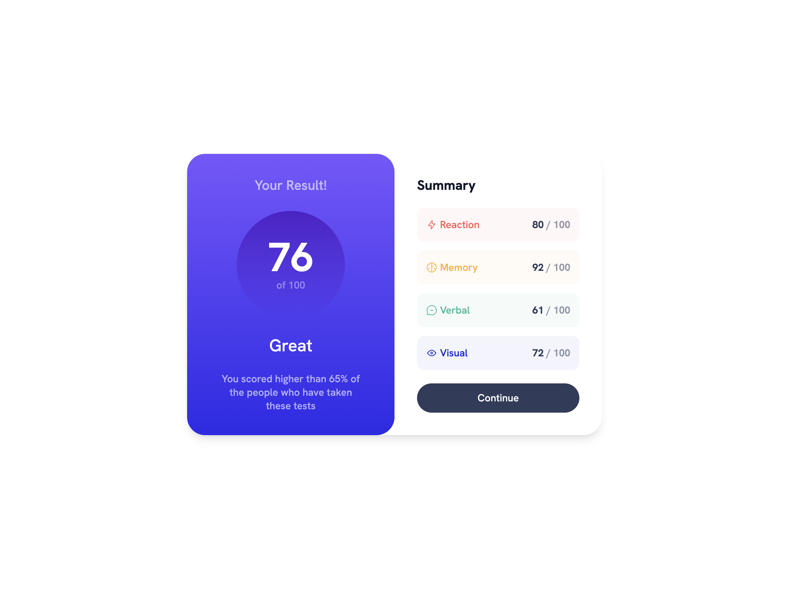
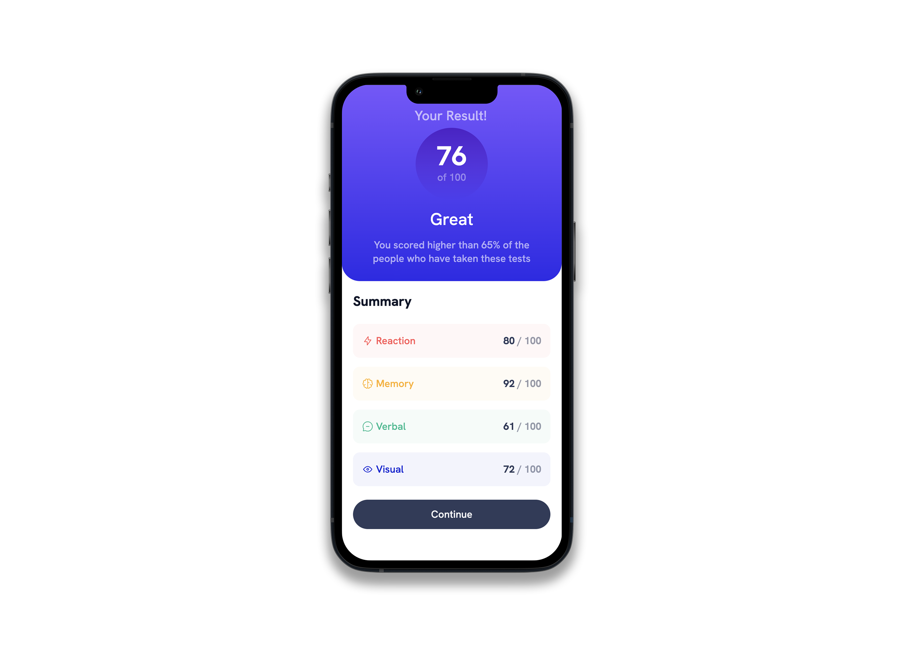

# Results summary component solution Solid.JS and TailwindCSS

This is a solution to the [Results summary component challenge on Frontend Mentor](https://www.frontendmentor.io/challenges/results-summary-component-CE_K6s0maV).

## Table of contents

- [Results summary component solution Solid.JS and TailwindCSS](#results-summary-component-solution-solidjs-and-tailwindcss)
  - [Table of contents](#table-of-contents)
  - [Overview](#overview)
    - [The challenge](#the-challenge)
    - [Screenshot](#screenshot)
    - [Links](#links)
  - [My process](#my-process)
    - [Built with](#built-with)
  - [Author](#author)

## Overview

### The challenge

Users should be able to:

- View the optimal layout for the interface depending on their device's screen size
- See hover and focus states for all interactive elements on the page

### Screenshot

### Links

- Solution URL: [GitHub](https://github.com/MichalBastrzyk/frontendmentor-results-summary-component-solidjs-tailwindcss)
- Live Site URL: [Vercel](https://frontendmentor-results-summary-component-solidjs-tailwindcss.vercel.app/)

## My process

### Built with

- Semantic HTML5 markup
- CSS custom properties
- Flexbox
- CSS Grid
- Mobile-first workflow
- Solid.JS
- TailwindCSS

## Author

- Frontend Mentor - [@MichalBastrzyk](https://www.frontendmentor.io/profile/MichalBastrzyk)
- GitHub - [@MichalBastrzyk](https://www.github.com/MichalBastrzyk)
